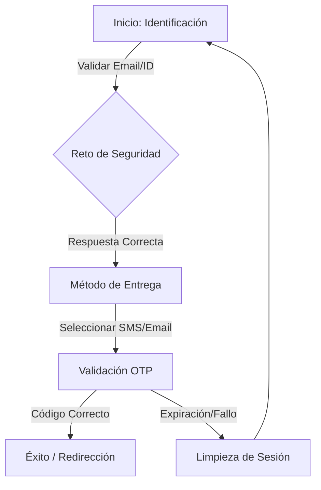

# OTP Service - Sistema de Autenticación de Alta Seguridad

**OTP Service** es una aplicación frontend desarrollada en **Angular 18+** diseñada para gestionar flujos de autenticación multifactor (MFA) con estándares de seguridad bancaria. La herramienta implementa capas de encriptación asimétrica, protección contra inyecciones y una gestión de estado blindada.

## 🛡️ Características de Seguridad (Hardening)

Esta herramienta no es un cliente web convencional; ha sido diseñada para mitigar ataques comunes mediante:

* **Encriptación Híbrida:** Uso de curvas elípticas (secp256k1) y AES-GCM para el intercambio de llaves y encriptación de payloads en cada petición HTTP.
* **Protección XSS Avanzada:** Integración de `DOMPurify` para sanitización de datos y una política de seguridad de contenido (**CSP**) estricta.
* **Ofuscación de Estado:** El identificador de sesión (`sid`) y el paso actual del flujo se almacenan en el `sessionStorage` mediante algoritmos de ofuscación (Salt + Base64 + Hex) para evitar ingeniería inversa simple.
* **Intercepción de Errores Ciega:** Los errores del backend son procesados por un interceptor que destruye trazas sensibles (stack traces) antes de que lleguen a la interfaz de usuario.
* **Guardianes de Ruta Dinámicos:** Validación en tiempo real del paso de autenticación permitido, impidiendo saltos de URL no autorizados.

## 🔄 Flujo de Funcionamiento

El sistema opera como una máquina de estados finitos. Un usuario no puede avanzar al paso `N` sin haber completado satisfactoriamente el paso `N-1`.

### Diagrama Lógico (Mermaid)


## 📦 Modelo de Datos y Contratos de API

Para garantizar una comunicación segura y predecible, el frontend espera que el backend responda siempre utilizando un envoltorio (wrapper) estándar para todas las peticiones HTTP. Todas las cargas útiles (payloads) viajan encriptadas mediante AES-GCM.

### Formato Base de Respuesta (Wrapper Estándar)
Todas las respuestas exitosas deben tener esta estructura principal:

```json
{
  "code": 200,
  "message": "Operación exitosa",
  "data": { } 
}
```
*(Nota: El contenido dinámico se envía dentro del objeto "data")*

### Contratos por Flujo (Ejemplos de `data`)

A continuación se detallan los objetos esperados dentro de la propiedad `data` dependiendo del paso en el que se encuentre el usuario:

**1. Identificación de Usuario (`/api/auth/identify`)**
Al enviar el correo o ID del usuario, el backend debe retornar el Identificador de Sesión (`SId`) temporal que acompañará el resto del flujo.

* **Request:** `{ "userId": "usuario@empresa.com" }`
* **Response `data`:**
 ```json
  {
    "SId": "eyJhbGciOiJIUzI1NiIsInR5...", 
    "requiredStep": 2, 
    "maskedEmail": "u******@empresa.com"
  }
```

**2. Solicitud de Código OTP (`/api/auth/send-otp`)**
Al seleccionar un método de entrega (SMS, Email, Llamada), el backend confirma el envío.
* **Request:** `{ "SId": "...", "channel": "SMS" }`
* **Response `data`:**
```json
  {
    "status": "sent",
    "expiresIn": 300, 
    "deliveryTarget": "********4567" 
  }
```

**3. Validación Final del Token (`/api/auth/validate`)**
El envío del código de 6 dígitos introducido por el usuario.
* **Request:** `{ "SId": "...", "otpCode": "123456" }`
* **Response `data`:**
```json
  {
    "status": "success",
    "accessToken": "jwt-final-de-acceso-al-sistema",
    "refreshToken": "jwt-de-refresco"
  }
```

### Manejo de Errores Esperado
En caso de validaciones de negocio (ej. código incorrecto) o fallos (HTTP 400, 401, 500), el frontend espera que el backend responda con el mismo formato, utilizando el campo `message` para mostrar la alerta al usuario a través del `ToastService`:

```json
{
  "code": 401,
  "message": "El código ingresado es incorrecto o ha expirado.",
  "data": null
}
```
*(Nota: El `ErrorInterceptor` del frontend destruirá automáticamente cualquier traza de error de servidor, asegurando que no se exponga información sensible de la infraestructura).*

## 🚀 Ejecución y Configuración

### Requisitos Previos
* **Node.js:** v18.19.0 o superior.
* **Angular CLI:** v18.0.0 o superior.

### Instalación
```bash
# Clonar el repositorio
git clone <url-del-repo>
cd otp-service

# Instalar dependencias
npm install
```

### Ejecución en Desarrollo
```bash
# Iniciar servidor de desarrollo
npm run start
```
La aplicación estará disponible en `http://localhost:4200`.

### Compilación para Producción (QA/Staging)
Hemos configurado reemplazos de archivos para entornos específicos en `angular.json`:
```bash
# Compilar para entorno de QA
ng build --configuration=test

# Compilar para Producción
ng build --configuration=production
```

## 🧪 Pruebas Unitarias (Testing)
El proyecto utiliza **Vitest** como motor de pruebas para garantizar una ejecución ultra rápida y compatibilidad con ESM.

```bash
# Ejecutar todas las pruebas
npm run test

# Ejecutar pruebas con cobertura
npx vitest run --coverage
```
*Se cubren servicios críticos como `CryptoUtils`, `HandleSession`, `SessionService` y componentes de UI.*

## ⚠️ Consideraciones Importantes

1.  **Llaves Públicas:** La llave pública RSA para la encriptación inicial debe actualizarse en `src/environments/environment.prod.ts`.
2.  **Sanitización:** Cualquier dato nuevo que se muestre en el HTML desde el backend debe pasar por el método `CryptoUtils.Sanitize()`.
3.  **Manejo de Sesión:** No utilices `localStorage` para datos sensibles de esta aplicación; el sistema está diseñado para limpiar el `sessionStorage` ante cualquier anomalía de seguridad detectada por el `HandleSession`.

## 📂 Estructura del Proyecto

* `core/`: Servicios globales, interceptores de seguridad, modelos y guardianes.
* `features/`: Módulos lógicos de cada paso del OTP (Login, Validación, etc.).
* `shared/`: Componentes reutilizables (Loading, Toast, Stepper) y utilitarios de criptografía.
* `layout/`: Estructura base (Header, Footer).

---

### Notas para el Desarrollador
Si necesitas añadir un nuevo paso al flujo:
1. Agrégalo al enum `AuthStep` en `src/app/core/models/Enums.ts`.
2. Actualiza la lógica de validación en `HandleSession.ts` para permitir la nueva ruta.
3. Asegúrate de que el componente llame a `this.handleSession.SetStep(AuthStep.NuevoPaso)` al inicializarse.